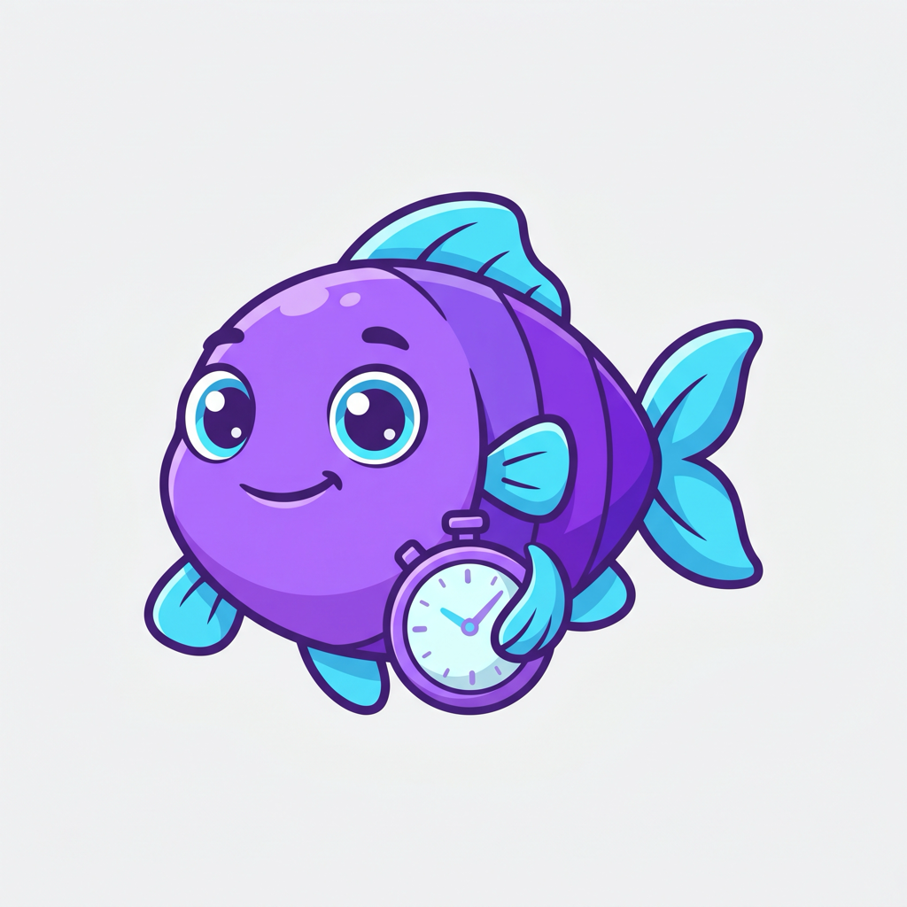
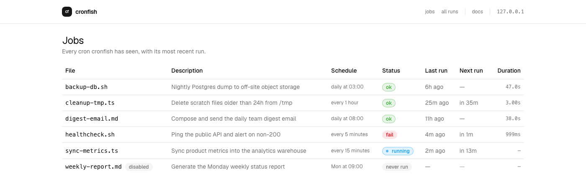

<p align="center">
  
</p>

<h1 align="center">cronfish 🐟</h1>

<p align="center"><strong>Write a cron job in Markdown — an LLM runs it on a schedule. Or drop a <code>.ts</code>/<code>.sh</code> script for the deterministic stuff. launchd fires all three.</strong></p>

<p align="center">
  <a href="https://www.npmjs.com/package/cronfish"></a>
  <a href="https://github.com/goldcaddy77/cronfish/actions/workflows/ci.yml"></a>
  = 1.0">
  
  <a href="./LICENSE"></a>
</p>

The pitch in one file. This is a complete, scheduled cron job:

```markdown
---
schedule: "every morning at 8"
model: sonnet
---

Read my calendar for today, check the weather, and post a
one-paragraph brief to the #daily Slack channel.
```

Drop it in `cron/`, run `cronfish sync`, and launchd runs it every morning — the body _is_ the job,
handed to an LLM at fire time. No script to write, no glue code. **Markdown is a valid cron job.**

When the work _is_ deterministic — a backup, a sync, a healthcheck — write it as `.ts` (Bun) or
`.sh` (bash) instead. Same frontmatter, same `cronfish sync`, no LLM in the loop. One scheduler,
three tiers; reach for the lightest that does the job.

It makes the file the job: frontmatter is the schedule, the path is the slug — no hand-written
plists, no registration step. You also get per-run logs, retries, concurrency guards, failure
alerts, fire-once jobs, and a dashboard. See [`examples/`](./examples) for a copy-pasteable job of
every kind.

<p align="center">
  
</p>

<p align="center"><em>The built-in dashboard — <code>cronfish ui</code>.</em></p>

## Why cronfish?

Two kinds of scheduler exist today, and neither does both halves:

- **cron / launchd** run scripts, never prose. A natural-language job isn't expressible.
- **Claude's native scheduled agents** run prose, but _only_ prose — every job is an LLM job on
  Anthropic's managed runtime, at their rates.

cronfish runs both from one folder:

- **Markdown jobs are natural-language cron.** The body is the instruction; cronfish hands it to an
  agent CLI (Claude Code by default) at fire time. No other scheduler runs a prose job.
- **Script jobs stay deterministic.** `.ts` and `.sh` run code you wrote — the standard cron trust
  model, first-class alongside `.md`.
- **Any harness, any model, local or hosted.** `.md` jobs shell out to a CLI you choose — point them
  at hosted Claude, a local Ollama model, or a LAN LiteLLM box. No managed-runtime markup; your data
  stays on your hardware.

Reach for Claude's scheduler when you want zero-ops and a single LLM task. Reach for cronfish when
you want a mix of prose and scripts, care about cost, or want to choose the model.

## Quickstart

```bash
bun add cronfish                 # or `bun add file:../cronfish` for local dev
bunx cronfish init               # scaffolds starter jobs in cron/ (disabled)
bunx cronfish enable hello-md    # flip on, sync to launchd
bunx cronfish list               # see what's scheduled and what's loaded
```

## Where jobs live

`cron/` is a tree, not a flat directory. Any `.md`, `.ts`, or `.sh` file at any depth is a job.

The slug encodes the kind: the path relative to `cron/` has its trailing `.<ext>` rewritten
to `-<ext>`, so:

- `cron/email/triage.ts` → slug `email/triage-ts`
- `cron/hello.md` → slug `hello-md`
- `cron/obsidian-keepalive.sh` → slug `obsidian-keepalive-sh`

This means `foo.md` and `foo.sh` can coexist without colliding. Use folders to group related
crons (`cron/email/`, `cron/linkedin/`).

One reserved filename: `README.md`. A file named exactly `README.md` is ignored at any depth, so
you can document a folder of crons without the README getting parsed as a job.

## Job spec

### Markdown — `cron/<slug>.md`

```markdown
---
schedule: "every 5 minutes" # see below for all accepted shapes
model: haiku # claude alias | raw ID | local:<name> | subconscious/<name>
enabled: true # default true
timeout: 300 # seconds; runner kills past this
retries: 0 # retry count on non-zero exit
concurrency: skip # skip | queue
---

Anything you'd type into a fresh Claude session — tools, files, prompts.
```

Cronfish shells to `claude --dangerously-skip-permissions --model <id> -p <body>` with `cwd =
consumer repo root`, so the job inherits your project's `.claude/` config (tools, MCP servers,
permissions) and your global `~/.claude/`.

### TypeScript — `cron/<slug>.ts`

```ts
export const config = {
  schedule: "every 10 minutes",
  enabled: true,
  timeout: 540,
  retries: 0,
  concurrency: "skip",
};

export default async function run(): Promise<void> {
  // anything. stdout/stderr captured to the log file.
}
```

### Bash — `cron/<slug>.sh`

```sh
#!/bin/bash
# ---
# schedule: every 5 minutes
# enabled: true
# timeout: 30
# concurrency: skip
# ---

echo "hello from bash"
```

Config lives in a `# ---` / `# ---` comment block at the top of the file (after the shebang, if
present). Each inner line is `# key: value` — same scalar rules as Markdown frontmatter. Cronfish
invokes the file as `/bin/bash <path>` with `cwd = consumer repo root`; stdout/stderr go to the
per-run log. **A `.sh` file with no frontmatter block fails at discovery** — cronfish prints the
error in `list`/`sync` so you know to add one.

## `model:` — claude alias, raw ID, local, or subconscious

For Anthropic-hosted models, use the aliases `haiku` / `sonnet` / `opus` (resolve to the latest
pinned IDs), or pass a raw ID like `claude-sonnet-4-6` verbatim.

For a **local model**, prefix with `local:` — e.g. `local:qwen2.5-coder:32b`. Cronfish still
spawns the same `claude` CLI, but with `ANTHROPIC_BASE_URL` pointed at a local
Anthropic-Messages-compatible endpoint. Ollama 0.14+ speaks this format natively, so the default
target is `http://localhost:11434` with auth token `ollama`. The model ID is passed as
`--model` **and** as the three slot overrides (`ANTHROPIC_DEFAULT_{HAIKU,SONNET,OPUS}_MODEL`)
plus `CLAUDE_CODE_SUBAGENT_MODEL`, so any sub-agents Claude spawns also route locally.

Override the endpoint for LiteLLM, LM Studio, or a LAN box:

```bash
export CRONFISH_LOCAL_BASE_URL="http://192.168.1.50:4000"
export CRONFISH_LOCAL_AUTH_TOKEN="sk-litellm-key"
```

Caveats: small local models (≤7B) often can't follow Claude Code's tool-heavy system prompt and
will hallucinate tool calls. Use 14B+ for any agentic loop; 32B is the practical floor for
multi-step work. Local providers serve one request at a time — set `concurrency: queue` on
overlapping jobs.

For a **[Subconscious](https://subconscious.dev)-hosted model**, use the id verbatim with its
`subconscious/` prefix — e.g. `subconscious/glm-5.2`. Same mechanics as `local:` (base URL +
slot overrides injected at spawn), pointed at `https://api.subconscious.dev` and authenticated
with `SUBCONSCIOUS_API_KEY` from the consumer `.env` (scope it into the job with
`env: [SUBCONSCIOUS_API_KEY]`). Override the endpoint with `SUBCONSCIOUS_BASE_URL`. The job
fails with a clear error if the key is unset.

## One-shot jobs — `cron/one-time/`

Drop a `.md`, `.ts`, or `.sh` under `cron/one-time/` to schedule a job that
fires **exactly once** at a `run_at` timestamp, then archives itself. Same
file format as recurring jobs except `schedule:` is replaced by `run_at:`.

```yaml
---
run_at: 2026-06-25T15:00:00-04:00   # absolute ISO, OR
run_at: "+30s"                      # relative to file mtime (s|m|h|d)
grace_seconds: 300                  # optional override; default 300 (5 min)
---
```

Sync behavior:

| `run_at` vs. now              | What happens                                      |
| ----------------------------- | ------------------------------------------------- |
| Future                        | plist installed with `StartCalendarInterval` for the exact minute |
| Within `grace_seconds` of now | plist installed with `RunAtLoad: true` — fires on bootstrap |
| Past `grace_seconds`          | **refused**; sentinel written + file archived out of `cron/one-time/` |
| `executed_at:` already set    | skipped (file should already be archived)         |

After firing, the runner stamps `executed_at: <ISO>`, moves the file to
`~/Library/Application Support/cronfish/done/` (outside the repo, so the audit
trail doesn't bloat git), and **removes its own plist** so a reboot/login in
the window before the next `cronfish sync` can't reload and re-fire it. A
`flock` plus the `executed_at` re-check guard against double-fires.

The runner also **re-checks `grace_seconds` at fire time**: launchd runs a
`StartCalendarInterval` job once on wake if the machine slept through the
scheduled minute (a coalesced missed fire), which can land long after `run_at`.
A fire that arrives past grace is refused (sentinel) instead of running late.

**One-time jobs must be idempotent.** The guards above catch the common
double-fire, but only after the file is stamped. Anything destructive between
"start" and "stamp" can repeat. Write handlers that tolerate two invocations.

**Failure surface — `cron/.errors/`.** Any refusal (past-grace, bad YAML,
missing `run_at`) and any runner-side failure (archive failed, `executed_at`
write failed) writes a sentinel there with slug, timestamp, and reason. Wire a
heartbeat cron to alert on non-empty. Two properties keep the folder bounded:
sentinels **dedup** (the same recurring error overwrites one file, not one per
sync), and sync-time sentinels **self-heal** — the next clean `cronfish sync`
clears any whose error no longer occurs. Inspect or clear by hand with
`cronfish errors` / `cronfish errors --clear [slug]`. cronfish only manages
files it wrote (`*.cronfish.txt`); a consumer can drop its own sentinels in the
same folder without them being reaped.

Smoke-test template: `templates/_examples/one-time/echo-at.md`.

## `schedule:` — one key, five shapes

| Input                     | Meaning                                       |
| ------------------------- | --------------------------------------------- |
| `"0 9 * * *"`             | cron (5 fields, integers or `*`)              |
| `"every 5 minutes"`       | human (`every minute`, `every N hours`, etc.) |
| `60`                      | bare number → seconds                         |
| `"60s"` / `"5m"` / `"1d"` | compact unit suffix                           |
| `"manual"`                | no autoschedule; run only via `cronfish run`  |

`manual` jobs are discovered, validated, and listed, but no plist is installed and no calendar
fires them. Use it for scheduling candidates — jobs you're staging in `cron/` before flipping on
a real schedule. Pure on-demand scripts that aren't scheduling candidates belong outside `cron/`.

**Sub-10s schedules don't work.** launchd enforces a ~10s floor between relaunches of the same
job (its implicit `ThrottleInterval`). A `schedule:` faster than `10s` fires no quicker than every
10s; `cronfish sync` warns when it sees one. Need true high-frequency work? Run a long-lived loop
as a single job instead of many fast fires.

## Config — `.cronfish.json` (optional, at repo root)

```json
{
  "bundle_prefix": "com.example.myapp",
  "bun_path": "/opt/homebrew/bin/bun",
  "ui": { "public_url": "https://mini.tail-xxx.ts.net:4747" },
  "alerts": {
    "on_failure": { "notify": "slack" },
    "default": "slack",
    "slack": { "webhook_url_env": "CRONFISH_SLACK_WEBHOOK" },
    "slack_bot": { "bot_token_env": "CRONFISH_SLACK_BOT_TOKEN", "channel": "C0123456789" },
    "shell": { "command": "/Users/you/bin/cronfish-pushover.sh" }
  }
}
```

- **`bundle_prefix`** — launchd plist label prefix; cronfish appends `.<slug>` per job. Defaults to
  `com.cronfish.<basename(cwd)>`.
- **`bun_path`** — optional absolute path to the `bun` binary baked into every plist's PATH.
  Use when you want to pin a specific install (multiple bun copies, version managers, non-standard
  prefix). When unset, cronfish resolves bun in this order: `$BUN_INSTALL/bin` → `/opt/homebrew/bin`
  → `~/.bun/bin` → `/usr/local/bin` → `which bun`. Homebrew and the official installer
  (`~/.bun`) work out of the box; for asdf/mise/proto, set `bun_path` explicitly.
- **`ui.public_url`** — base URL used to build links in alert payloads (e.g. `<base>/runs/<id>`).
  Explicit only; no Tailscale auto-detect.
- **`alerts`** — see [Alerts](#alerts) below.

## CLI

```
cronfish init                       scaffold cron/hello.md + cron/touch.ts + cron/ping.sh + cron/watchdog.sh
cronfish list                       every job + state
cronfish next [slug] [N]            preview the next N fire times (default 5)
cronfish sync                       reconcile cron/ ↔ launchd (idempotent)
cronfish enable <slug>              flip enabled, then sync
cronfish disable <slug>             flip disabled, then sync
cronfish delete <slug> --yes        bootout + remove plist + job file
cronfish status [slug]              launchctl print + tail of latest log
cronfish errors [--clear] [slug]    list error sentinels (cron/.errors/); --clear removes them
cronfish run <slug>                 run now — queues through a live daemon, else spawns the runner directly
cronfish daemon                     run the v2 scheduler daemon in the foreground (1s tick loop)
cronfish daemon install             hot-swap: retire per-job plists, install the KeepAlive daemon plist
cronfish daemon uninstall           bootout + remove the daemon plist (per-job plists NOT restored — run sync)
cronfish history [slug] [--limit N] [--since 7d]   run timeline: started, trigger, status, duration, result
cronfish stats [--since 30d]        per-job rollup: runs, success %, avg/p95 duration, last status
cronfish watchdog                   detect missed schedules → fire alerts
cronfish alerts test [adapter]      send a test alert via the named (or default) adapter
cronfish ui [--port N] [--no-open]  local web dashboard (default 127.0.0.1:4747)
cronfish ui install [--port N]      install dashboard as a launchd daemon (auto-restart, runs at login)
cronfish ui uninstall               bootout + remove dashboard daemon
cronfish ui status                  show dashboard daemon state
cronfish --version
```

## Alerts

Every failed (`fail` / `timeout` / `crashed`) scheduled run pings the configured adapter, and the first `ok` after a failure pings once as `recovered`. Missed schedules are caught by `cronfish watchdog` (scaffolded as `cron/watchdog.sh`, scheduled `every 5 minutes`, disabled by default — flip on after configuring `alerts`).

Adapters ship with cronfish:

- **`slack`** — POSTs Block Kit to an incoming webhook. Reads the URL from the env var named in `alerts.slack.webhook_url_env` (default `CRONFISH_SLACK_WEBHOOK`).
- **`slack_bot`** — posts the same Block Kit via `chat.postMessage` with a bot token instead of a webhook. One token reaches any channel (with `chat:write.public`, no invite needed), so you skip the per-channel browser-OAuth webhook mint. Reads the token from `alerts.slack_bot.bot_token_env` (default `CRONFISH_SLACK_BOT_TOKEN`) and the target channel from `alerts.slack_bot.channel` (a `C…` id or `#name`) or `alerts.slack_bot.channel_env`. Unlike a webhook, `chat.postMessage` returns HTTP 200 on logical errors, so the adapter inspects the JSON `ok` field and fails on `ok:false` (e.g. `channel_not_found`, `not_in_channel`).
- **`shell`** — runs an arbitrary command from `alerts.shell.command` with the payload as env vars (`CRONFISH_ALERT_SLUG`, `…_STATUS`, `…_EXIT_CODE`, `…_DURATION_MS`, `…_STARTED_AT`, `…_UI_URL`, `…_LOG_TAIL`) plus the JSON payload on stdin. Use this for Pushover/ntfy/osascript.

Two knobs in `.cronfish.json`, two distinct jobs:

- **`alerts.on_failure: { notify: "slack" }`** — fleet-wide default. When set, every scheduled job alerts via that adapter on failure unless its frontmatter says otherwise. When unset, jobs are silent by default.
- **`alerts.default: "slack"`** — picks which adapter `cronfish alerts test` uses when invoked without an arg. Adapter-selection only; does NOT cause jobs to alert.

Per-job overrides via frontmatter:

```yaml
schedule: "every 5 minutes"
on_failure:
  notify: slack          # opt in / pick a specific adapter for this job
missed_after: 30m        # optional override of the watchdog's grace window
```

```yaml
on_failure:
  notify: none           # opt OUT of the fleet default for this job
```

Resolution order: per-job `notify` (including the `"none"` opt-out) → `alerts.on_failure.notify` → no alert (silent skip — recorded in the ledger as `alert_status='skipped'`).

Failures inside the adapter never block the run: `alert_status='error'` and `alert_error` capture the reason; stderr gets one line. Manual `cronfish run <slug>` invocations do **not** fire alerts — that's the debugging path.

Sanity check:

```
export CRONFISH_SLACK_WEBHOOK=https://hooks.slack.com/services/...
cronfish alerts test slack

# or, bot-token path (no webhook to mint):
export CRONFISH_SLACK_BOT_TOKEN=xoxb-...
cronfish alerts test slack_bot
```

## Always-on dashboard

The dashboard is daemon-aware: a header badge shows the v2 scheduler's liveness (pid, version,
uptime from its heartbeat, via `/api/daemon`) and turns into a loud banner when the daemon is dead
or stale — a dead scheduler must never look like "all quiet". The jobs table shows the daemon's
own `next_run_at`, and post-downtime `catchup` runs get their own badge in the run history.

`cronfish ui` runs the dashboard in the foreground. To keep it up across reboots and crashes, install it as a launchd daemon:

```
cronfish ui install            # one-time, default port 4747
cronfish ui status             # label + plist + pid
cronfish ui uninstall          # bootout + remove
```

`install` writes `~/Library/LaunchAgents/<prefix>.ui.plist` with `KeepAlive` + `RunAtLoad`, logs to `<consumer>/.cronfish/logs/ui.log`, and dispatches it via `launchctl bootstrap`. Default bind is `127.0.0.1` (no auth, not exposed). To reach the dashboard from another machine on your LAN, install with `--host 0.0.0.0`:

```
cronfish ui install --host 0.0.0.0
```

`ui status` then prints the LAN URL.

## Files cronfish writes

```
cron/<slug>.{md,ts,sh}                              # job files (you write these)
~/Library/LaunchAgents/<prefix>.<slug>.plist        # launchd registration
<consumer>/.cronfish/logs/<slug>/<id>.log           # per-run log
<consumer>/.cronfish/locks/<slug>/runner.pid        # concurrency lock
<consumer>/.cronfish/db.sqlite                       # run ledger (history, metrics)
```

`.cronfish/` is created automatically; add it to `.gitignore`.

### Retention (logs + ledger rows)

Per-run logs and ledger rows (`cron_invocations`, `cron_run_requests`, `cron_missed_alerts`)
accumulate forever — on an always-on machine that grows unbounded. `cronfish prune` deletes old
ones:

```
cronfish prune                       # prune every slug per retention config
cronfish prune <slug>                # prune one slug
cronfish prune --dry-run             # show what would go, delete nothing
cronfish prune --max-age-days 14     # ad-hoc override (ignores config)
cronfish prune --max-runs 50         # keep only the 50 newest logs per slug
```

With no config and no flags, `prune` falls back to `max_age_days: 30`. Configure retention in
`.cronfish.json` to set a policy — and `sync` will then auto-prune on every run:

```json
{
  "retention": {
    "max_age_days": 30,
    "max_runs": 100,
    "per_slug": {
      "noisy-job-md": { "max_runs": 20 }
    }
  }
}
```

`max_age_days` deletes logs older than N days; `max_runs` keeps only the N newest per slug; set both
and a log is pruned if it fails *either*. A `per_slug` entry fully replaces the global policy for
that slug. Auto-prune on `sync` is opt-in: it runs only when `retention` is set, so an unconfigured
repo never silently loses history. The dashboard's `ui.log` is left untouched.

`max_age_days` also ages out ledger **rows**: invocations, run requests, and missed-alert records
older than the window are deleted (`max_runs` is log-file-only). Safety rails: a `running` row
younger than 24h is never deleted (older `running` rows are crash debris and prune normally), and
`cron_jobs` rows are never deleted — job history tombstones stay forever. The v2 daemon runs the
same prune automatically once per day when `retention` is configured.

## Retries & concurrency

- `retries:` — on non-zero exit, retry up to N more times with exponential backoff (5s, 15s, 45s,
  capped at 60s). Retry lines append to the same log.
- `concurrency: skip` — if a prior run is still in flight, exit 0 immediately.
- `concurrency: queue` — poll every 2s for the lock, up to the job's `timeout`.

## Security

cronfish runs three kinds of job, and they don't carry the same risk:

- **`.ts` and `.sh`** run code *you* wrote — the standard cron trust model.
  Nothing here is more dangerous than the cron line you'd write by hand.
- **`.md`** runs an agent (Claude Code) that decides for itself which tools to
  call. That's the tier worth fencing, and the controls below are aimed at it.

The default for a `.md` job is `--dangerously-skip-permissions` (every tool
allowed) so existing setups keep working. Treat that as fine for jobs you
fully trust and dial in the controls — **scope secrets, fence tools, cap
spend, go read-only** — for anything open-ended or untrusted. For true
isolation, run the job in a [container](#container-escape-hatch).

| Control                       | Knob              | Tier        |
| ----------------------------- | ----------------- | ----------- |
| Inject only the secrets needed | `env:`           | `.md`/`.sh` |
| Allow only specific tools      | `allowed_tools:`  | `.md`       |
| Cap dollars per run            | `max_cost:`       | `.md`       |
| Deny mutating tools            | `read_only:`      | `.md`       |
| Network egress + filesystem    | container         | any         |

### Secrets in plists

At `cronfish sync`, every plist's `EnvironmentVariables` block is populated
with the consumer's `.env` plus the required keys (`HOME`,
`CRONFISH_CONSUMER_ROOT`, `PATH`). This is what lets `.md` and `.sh` runs
(which bypass bun's auto-`.env` loader) reach postgres, Linear, Slack, etc.

Required keys win on collision. Quoted values are unquoted; `#` is treated as
an inline comment only on unquoted values. Re-run `cronfish sync` after
editing `.env` so the plists pick up the new values.

### Scoped secrets — `env:`

By default a job's plist carries the **whole** `.env`. Declare an `env:`
allowlist in frontmatter to inject only the keys a job actually needs:

```
---
schedule: every 30 minutes
env: [LINEAR_TOKEN, DATABASE_URL]
---
```

The job sees those two keys, not all forty. `env: []` injects no consumer
secrets at all; omitting `env:` keeps the full-`.env` default (backward
compatible). A declared key missing from `.env` is skipped with a warning.

This fences the `.md` (Claude Code) and `.sh` tiers, which read secrets from
the plist block. **`.ts` jobs also read `.env` directly via bun's auto-loader,
so `env:` does not constrain them** — for a `.ts` job, keep secrets out of
`.env` or isolate the job in a container.

### Permission fence — `allowed_tools:` (`.md` jobs)

By default the Claude Code runner runs with `--dangerously-skip-permissions`
(every tool allowed). Declare an `allowed_tools:` list to swap that blanket
bypass for a capability fence:

```
---
schedule: every 30 minutes
allowed_tools: [Read, "Bash(git status)", mcp__linear__*]
---
```

The run then uses `--permission-mode default --allowedTools <list>`; in
headless mode any tool **not** on the list can't prompt, so it auto-denies —
the job never hangs. Omitting `allowed_tools:` keeps the skip-permissions
default (backward compatible). `.md` jobs only — `.ts`/`.sh` run your own code.

### Budget cap — `max_cost:` (`.md` jobs)

Cap the dollars an LLM job may spend in a single run:

```
---
schedule: every 5 minutes
max_cost: 0.50
---
```

Passed to the CLI as `--max-budget-usd`; the run stops making API calls once
the cap is hit. Backstops a runaway loop or an LLM quietly billing on a short
cron. Accepts a fraction (`0.50`) or a whole number (`2`). Unset → no cap.

### Read-only — `read_only:` (`.md` jobs)

"Draft but don't send." Denies the mutating built-in tools so a job can
read, search, and draft but never edit files or shell out:

```
---
schedule: every morning at 8
read_only: true
---
```

Passed as `--disallowedTools Write Edit NotebookEdit Bash`, which holds under
both the skip-permissions default and an `allowed_tools` fence (deny wins on
overlap). **MCP sends aren't auto-detected** — cronfish can't tell a reading
MCP tool from a sending one by name, so pair `read_only:` with an
`allowed_tools:` list to fence Gmail/Linear mutations.

### Container escape hatch

The frontmatter controls fence *which tools* a job may call; they don't
sandbox the filesystem or the network. For an untrusted or wide-open job, run
it inside an ephemeral container — the only option on macOS that gets you real
network-egress control. The job file is a plain `.sh` that shells out to
Docker / [OrbStack](https://orbstack.dev):

```bash
#!/bin/bash
# ---
# schedule: every day at 3am
# env: [ANTHROPIC_API_KEY, DATABASE_URL]
# ---
set -euo pipefail

docker run --rm \
  --network cronfish-egress \
  --mount type=bind,src="$PWD/cron/_work",dst=/work \
  --env ANTHROPIC_API_KEY --env DATABASE_URL \
  --memory 1g --cpus 1 \
  my-claude-runner:latest /work/task.md
```

Each flag earns its place:

- `--rm` — the container dies on exit; nothing persists between runs.
- `--network cronfish-egress` — a Docker network whose policy allows only
  `api.anthropic.com` + your DB, so a compromised job can't phone home.
- `--mount …src=cron/_work` — the job sees **only** that directory, not your
  whole repo or home dir.
- `--env ANTHROPIC_API_KEY --env DATABASE_URL` — forwards just the scoped
  secrets; pair with the `env:` frontmatter so the launchd plist hands the
  wrapper only those keys to begin with.

Build the egress network once (then add your allow rules to it):

```bash
docker network create --internal cronfish-egress
```

This is opt-in and heavier than the frontmatter knobs — reach for it when a
job is genuinely untrusted or you need hard network/filesystem boundaries, not
for everyday jobs.

## How cronfish finds bun

Plists invoke `/usr/bin/env bun <runner.ts>`. At `cronfish sync`, cronfish resolves your current
`bun` binary and bakes its directory into the plist's `PATH` (the `bun_path` config option above
covers the resolution order and how to pin it). Bun auto-loads `.env` from the consumer root (set
via plist `WorkingDirectory`), so no shell wrapper is needed.

- After `bun upgrade` (in place) or a `brew upgrade bun` (same dir) — no re-sync needed.
- After moving bun to a different directory — re-run `cronfish sync` so the plist PATH picks up
  the new location.

## Requirements

- macOS (launchd). Linux (systemd) and Windows (Task Scheduler) are on the backlog.
- Bun ≥ 1.0.
- **A logged-in GUI (Aqua) session.** cronfish installs per-user LaunchAgents under
  `~/Library/LaunchAgents`, which only load while the user is logged into the desktop. On a
  headless box reached only over SSH (no console login), agents never load and jobs never fire —
  enable auto-login, or keep a desktop session active. (A system-wide `LaunchDaemon` backend that
  runs without a login session is on the backlog.)

## Status

v0.x — used in production by the author. API may still break before v1. File issues if you hit
something rough.

## License

MIT. See `LICENSE`.
